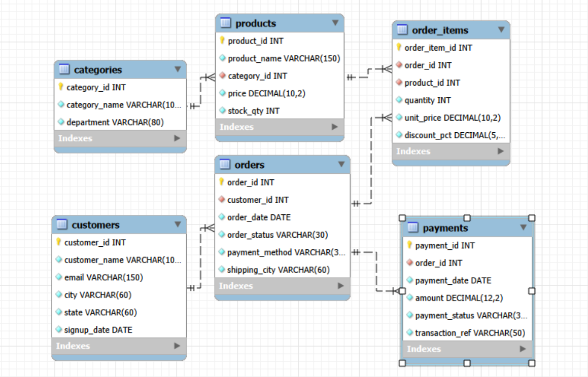

# 🛒 E-Commerce Sales & Customer Analytics using MySQL


## 📌 Project Overview

This project focuses on analyzing an e-commerce business using MySQL and SQL.

The objective is to transform relational sales, customer, product, order and payment data into meaningful business insights that can support data-driven decision making.

The project was developed as a Data Analyst portfolio project using MySQL Workbench.

---

## 🎯 Business Objectives

* Analyze overall e-commerce sales performance
* Identify top-performing products
* Analyze revenue by category and department
* Identify high-value customers
* Analyze customer purchasing behavior
* Study monthly revenue trends
* Analyze payment methods
* Identify low-stock products
* Analyze discounts and sales performance
* Identify repeat customers
* Analyze city-wise revenue
* Identify high-value orders

---

## 🗄️ Database Structure

The database contains 6 interconnected tables:

| Table         | Description                           |
| ------------- | ------------------------------------- |
| `customers`   | Customer information                  |
| `categories`  | Product categories and departments    |
| `products`    | Product details, prices and inventory |
| `orders`      | Customer order information            |
| `order_items` | Products included in each order       |
| `payments`    | Payment and transaction information   |

### Database Relationship

```text
Customers
    │
    ▼
  Orders ─────────► Payments
    │
    ▼
Order Items
    │
    ▼
 Products
    │
    ▼
Categories
```

---

## 📊 Dataset Size

| Metric      |  Value |
| ----------- | -----: |
| Customers   |    500 |
| Categories  |     50 |
| Products    |  1,000 |
| Orders      |  5,000 |
| Order Items | 15,000 |
| Payments    |  5,000 |

---

## 🛠️ Tools & Technologies

* MySQL
* MySQL Workbench
* SQL
* Relational Database Design
* Data Analysis
* Business Intelligence

---

## 🧠 SQL Concepts Used

### Basic SQL

* SELECT
* WHERE
* ORDER BY
* GROUP BY
* HAVING
* CASE

### Advanced SQL

* INNER JOIN
* LEFT JOIN
* Subqueries
* CTEs
* Window Functions
* DENSE_RANK()
* ROW_NUMBER()
* Aggregate Functions
* Analytical Views

---

## 🔍 Key SQL Analysis

The project contains 20 analytical queries covering:

1. Database size analysis
2. Overall business KPIs
3. Top products by revenue
4. Revenue by category
5. Top customers by lifetime value
6. Monthly revenue trends
7. Revenue by city
8. Order status distribution
9. Payment method performance
10. Average Order Value
11. Customers with more than 10 orders
12. Low-stock products
13. High-value orders
14. Top 3 customers in each city
15. Top 5 products within each department
16. Category revenue using CTE
17. Repeat customer analysis
18. Discount analysis
19. Department performance
20. Pending and refunded payments

---

## 📈 Analytical Views

Three reusable SQL views were created:

### `vw_product_performance`

Used to analyze product-level sales performance.

### `vw_customer_value`

Used to analyze customer orders and lifetime value.

### `vw_monthly_revenue`

Used to analyze monthly revenue and paid transactions.

---

## 📸 Project Screenshots

### ER Diagram



### SQL Query Output

Screenshots of the SQL queries and their outputs are available in the `Screenshots` folder.

---

## 💡 Business Insights

The analysis helps answer important business questions such as:

* Which products generate the highest revenue?
* Which categories contribute the most sales?
* Which customers have the highest lifetime value?
* Which cities generate the most revenue?
* What are the monthly revenue trends?
* Which payment methods contribute the most revenue?
* Which products require inventory attention?
* Which customers are highly engaged?
* How do discounts affect sales?
* Which departments perform best?

---

## 📂 Project Structure

```text
Ecommerce-Sales-Customer-Analytics-MySQL
│
├── SQL
│   └── Ecommerce_Analytics_MySQL_project.sql
│
├── Presentation
│   └── Ecommerce_Analytics_MySQL_Project.pptx
│
├── Screenshots
│   ├── ER_Diagram.png
│   ├── Query_01_Output.png
│   ├── Query_02_Output.png
│   └── ...
│
└── README.md
```

---

## 🚀 How to Run the Project

### 1. Install MySQL

Use MySQL 8.x and MySQL Workbench.

### 2. Open the SQL file

Open:

```text
SQL/Ecommerce_Analytics_MySQL_project.sql
```

### 3. Execute the script

Run the SQL script in MySQL Workbench.

The script creates:

```text
ecommerce_analytics_db
```

### 4. Explore the database

Run the analytical queries provided in the SQL file.

---

## 👨‍💻 Author

**Sahil Kanojia**

Aspiring Data Analyst

Skills:
`Excel` `SQL` `MySQL` `Python` `Data Analysis`

---

⭐ If you found this project useful, feel free to explore the repository and connect with me on LinkedIn.
